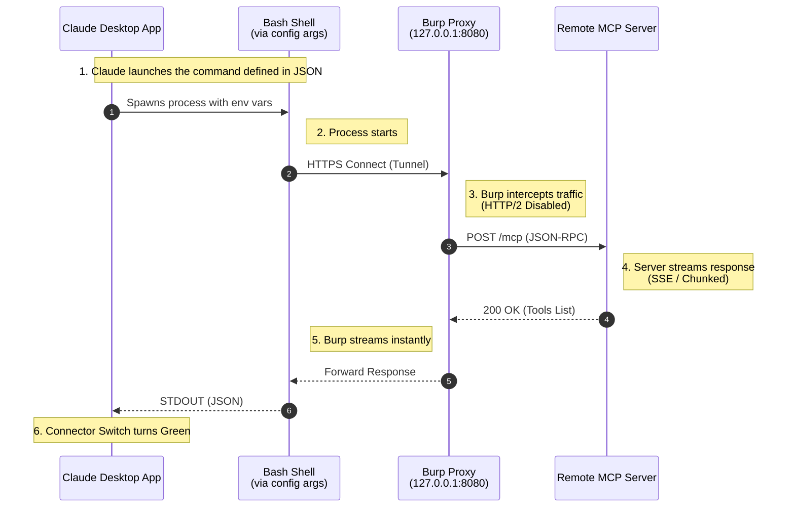
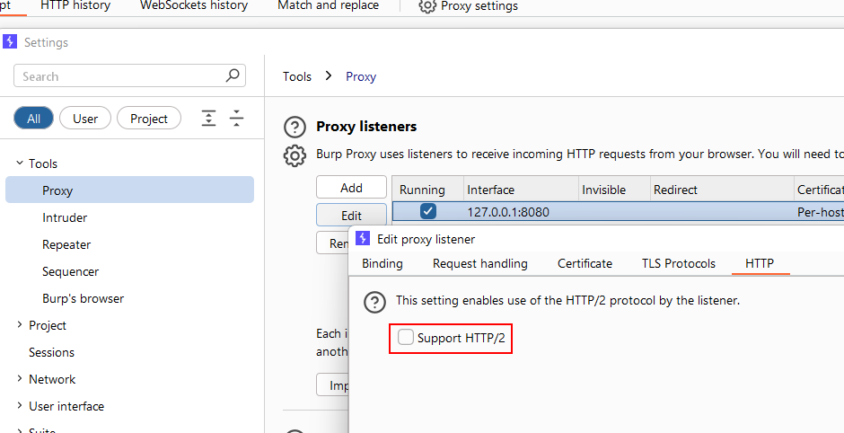
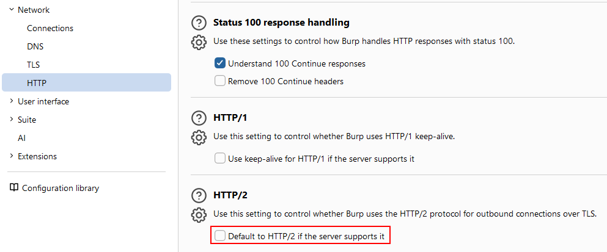
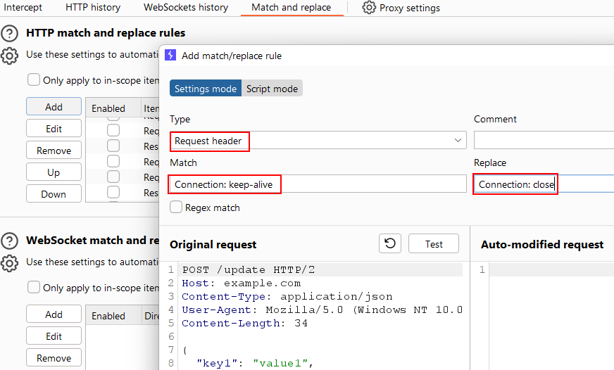
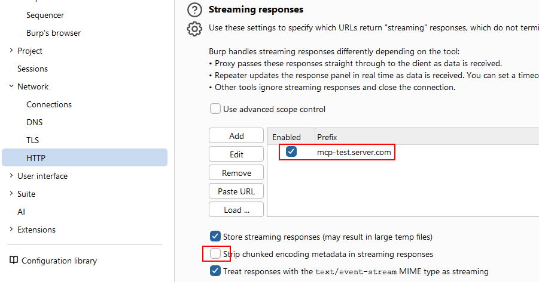
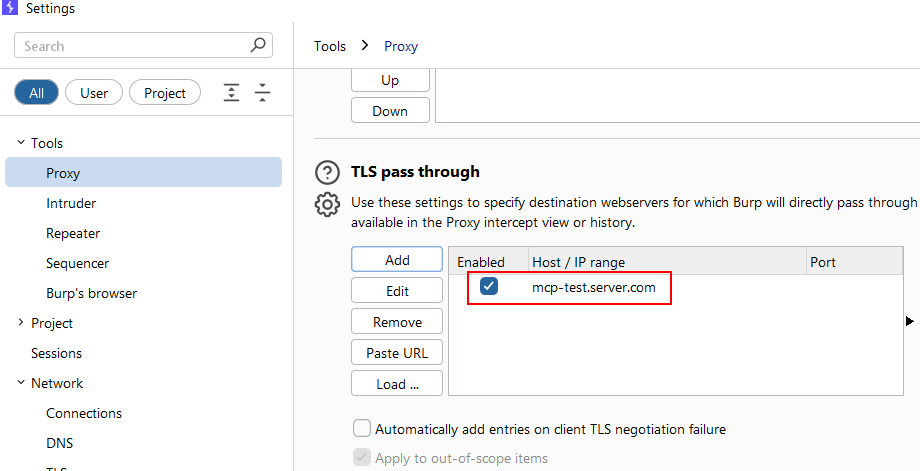

<!-- Welcome 👋 -->



## Overview
If you are pentesting [Model Context Protocol (MCP)](https://modelcontextprotocol.io/) servers, the **Claude Desktop** app is the ultimate integration test. But debugging it can feel like working in a black box.

When your connection fails or tools don't show up, you often get a generic *"Connection Failed"* message. There are no detailed logs, no network tab, and no visibility into the JSON-RPC messages flying back and forth.

I recently needed to connect Claude Desktop to a remote MCP server while routing the traffic through **Burp Suite** to inspect the payloads. It turned out to be much harder than just setting an environment variable.

After hours of debugging Node.js timeouts, HTTP/2 protocol errors, and silent crashes, I found the working configuration. Here is the complete guide to gaining full visibility into your MCP traffic.

## The Architecture
Before we fix the config, it helps to understand *why* this is difficult. We are trying to force a strictly typed Node.js client (inside Claude) to talk through a Java-based proxy (Burp) to a remote server, all while maintaining a persistent Server-Sent Events (SSE) stream.



### Step 1: The "All-in-One" Configuration
You don't need complex wrapper scripts. You can achieve full proxy interception directly inside your claude_desktop_config.json file.

First, install the mcp-remote tool globally to avoid npx timeouts:

```bash
npm install -g mcp-remote
```

Then, use this configuration (adjust paths for your OS):
claude_desktop_config.json
```
{
  "mcpServers": {
    "server": {
      "command": "/bin/bash",
      "args": [
        "-c",
        "/opt/homebrew/bin/mcp-remote https://your-remote-server.com/mcp --enable-proxy --header \"Authorization: Bearer $API_TOKEN\" 2> /tmp/mcp_stderr.log"
      ],
      "env": {
        "API_TOKEN": "YOUR_ACTUAL_TOKEN_HERE",
        "HTTP_PROXY": "http://127.0.0.1:8080",
        "HTTPS_PROXY": "http://127.0.0.1:8080",
        "NODE_TLS_REJECT_UNAUTHORIZED": "0",
        "PATH": "/opt/homebrew/bin:/usr/local/bin:/usr/bin:/bin:/usr/sbin:/sbin"
      }
    }
  }
}
```

💡**Why This Works (The "Gotchas")**

* **Absolute Paths:** GUI apps don't load your $PATH. You must point directly to the binary (e.g., /opt/homebrew/bin/mcp-remote).
* **Proxy Flags:** The mcp-remote tool ignores proxy env vars unless you explicitly pass --enable-proxy.
* **Logging:** Redirecting stderr to a file (2> /tmp/mcp_stderr.log) gives you the only visibility into why a connection dies. Never redirect stdout, or you will break the pipe to Claude.

### Step 2: Configuring Burp Suite (Critical)
Node.js's HTTP client (undici) is extremely strict. Default Burp settings will cause the connection to crash immediately. You must apply these three specific fixes.

#### Fix A: Disable HTTP/2 (Prevent Protocol Crashes)

Burp often tries to downgrade HTTP/2 connections incorrectly, causing "Invalid Header" errors. You must disable it on **both** sides.

* **Listener:** Go to **Proxy** > **Proxy Settings** > **Edit Proxy Listeners (127.0.0.1:8080)** > **HTTP Tab** > **Uncheck "Support HTTP/2"**.

* **Upstream:** Go to **Settings** > **Network** > **HTTP** > **HTTP/2** > **Uncheck "Enable HTTP/2"**.


#### Fix B: Prevent Connection Blocking (The "One Lane" Fix)

Since we disabled HTTP/2, the initial SSE stream "hogs" the single TCP connection. If you try to run a tool, the request will hang because the socket is busy. We must force a new connection for every request.

1.  Go to: **Proxy** > **Match and Replace**.
2.  **Add Rule:**
    * **Type:** Request header
    * **Match:** Connection: keep-alive
    * **Replace:** Connection: close
    

#### Fix C: Enable Streaming Responses

Tell Burp explicitly not to wait for this URL.

1.  Go to: **Settings** > **Network** > **HTTP** > **Streaming Responses**.
2.  **Add URL:** your-server-domain.com
3.  **Crucial:** Check **"Store streaming responses"** (so you can see them) and Uncheck **"Strip chunked encoding metadata"**.


### Step 3: The "Toggle Trick" (Pro Tip)

> If you have done all the above and Claude still times out during the initial connection (showing a disabled switch), use the **Pass-Through Toggle Trick**.

The initial handshake (**tools/list**) is often too large and fragile for the proxy to buffer instantly.

1.  **Enable Pass Through:** Go to **Settings** > **Tools** > **Proxy** > **TLS Pass Through** and add your server domain.
2.  **Start Claude:** The connection will succeed immediately (bypassing Burp) and the switch will turn Green.
3.  **Disable Pass Through:** While Claude is running, **remove** the domain from the TLS Pass Through list.


📊**Result:** The connection stays alive, but now Burp will begin capturing all *subsequent* traffic (like tool executions and prompts) perfectly.

## 🚀 Conclusion

Debugging MCP servers doesn't have to be a guessing game. By forcing the traffic through a proxy, you can inspect every tool call, fuzz inputs, and verify security controls—all from within your local development flow.

Happy Intercepting!


<style>
  .mermaid {
    background-color: white !important;
    padding: 20px;
    border-radius: 8px;
  }
</style>