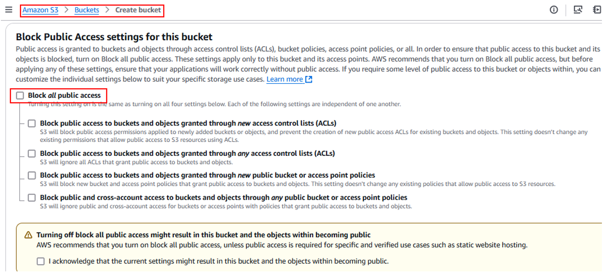
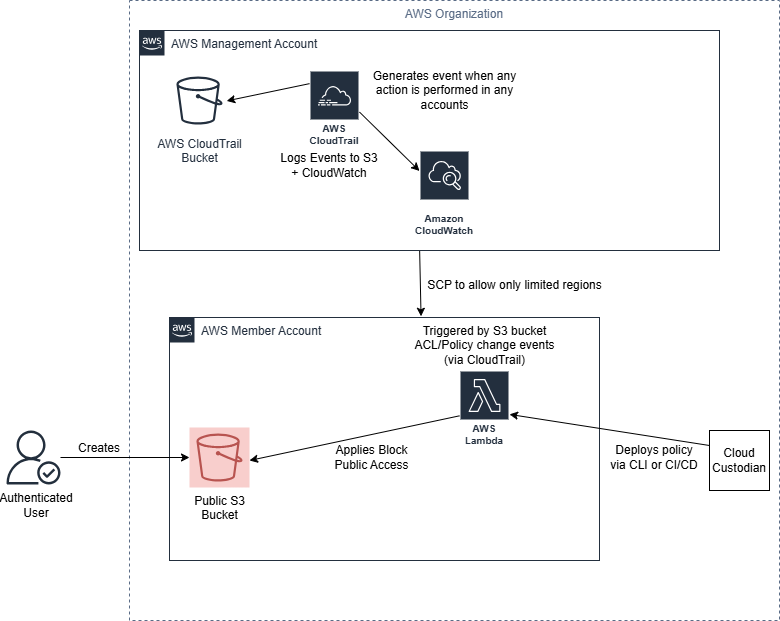
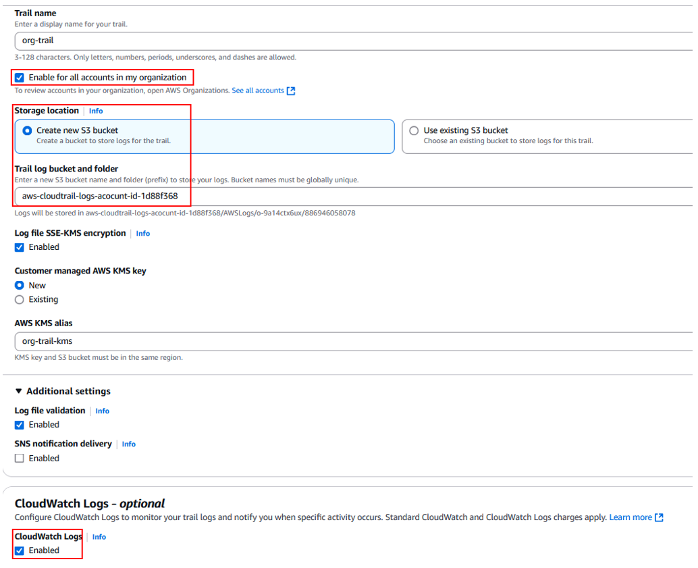
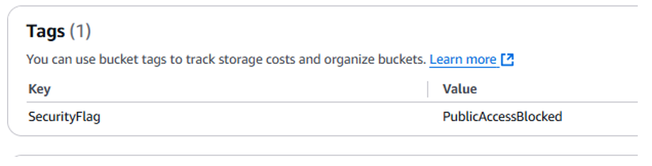

## ✨ Introduction
S3 bucket misconfigurations have caused some of the most well-known and damaging cloud data breaches. Whether it's through an overly permissive bucket policy or an ACL setting gone wrong, public exposure of sensitive data is a risk you can't afford in a cloud-first world.
As a security consultant, I wanted to build a proof-of-concept that does more than detect misconfigurations—it auto-remediates them. This blog walks through how I used AWS CloudTrail and [Cloud Custodian](https://cloudcustodian.io/) to automatically block public access whenever an S3 bucket is made public.


## 💡 Problem Statement
S3 buckets can be made public in several ways:
-	Via a bucket policy that allows Principal: *
-	Through ACLs granting public read or write access

These are sometimes accidental and often go unnoticed until it's too late.

Note: For above settings to work we must first make sure that we uncheck the “Block all public access”, as shown in the figure below:


## 📋 Goal
Build a system that:
1.	Detects changes to S3 ACLs and policies using CloudTrail
2.	Automatically applies AWS's Block Public Access settings
3.	Tag the bucket with security-related metadata

## 🌐 Architecture Overview

-	Management Account: Hosts the AWS Organization, SCPs, and a centralized CloudTrail
-	Member Account: Where the actual misconfiguration and remediation occurs
-	CloudTrail: Organization trail logs events from all accounts to S3 and CloudWatch Logs
-	Cloud Custodian: Runs in the member account as a Lambda to remediate changes in real time


## ✍️ Step-by-Step Implementation
1. Setup AWS Organization & SCPs
From the management account, I created the following SCPs:
-	DenyLeavingOrganization: Prevents member accounts from removing themselves from the organization
-	DenyAllExceptTwoRegions: Restricts use to specific AWS regions
These policies were attached to a test member account.

DenyLeavingOrganization.json
```
{
  "Version": "2012-10-17",
  "Statement": [
    {
      "Sid": "DenyLeavingOrganization",
      "Effect": "Deny",
      "Action": [
        "organizations:LeaveOrganization"
      ],
      "Resource": "*"
    }
  ]
}
```
DenyAllExceptTwoRegions.json
```
{
  "Version": "2012-10-17",
  "Statement": [
    {
      "Sid": "DenyUnsupportedRegions",
      "Effect": "Deny",
      "Action": "*",
      "Resource": "*",
      "Condition": {
        "StringNotEquals": {
          "aws:RequestedRegion": [
            "ap-south-1",
            "us-east-1"
          ]
        }
      }
    }
  ]
}
```

2. Create an Org Trail
In the management account:
-	Create a new organization trail in CloudTrail
-	Enable logging to an S3 bucket and to a CloudWatch Logs group

This captures events from all member accounts in near real-time.


3. Create IAM Role for Cloud Custodian
In the member account:
-	Create an IAM Role CloudCustodianExecutionRole
-	Attach the following refined policy:
```
{
  "Version": "2012-10-17",
    "Statement": [
        {
            "Sid": "S3Access",
            "Effect": "Allow",
            "Action": [
                "s3:GetBucketAcl",
                "s3:GetBucketPolicy",
                "s3:PutBucketAcl",
                "s3:PutBucketPolicy",
                "s3:GetBucketTagging",
                "s3:PutBucketTagging",
                "s3:PutBucketPublicAccessBlock",
                "s3:GetBucketPublicAccessBlock",
                "s3:ListBucket",
                "s3:ListAllMyBuckets"
            ],
            "Resource": "*"
        },
        {
            "Sid": "CloudWatchLogs",
            "Effect": "Allow",
            "Action": [
                "logs:CreateLogGroup",
                "logs:CreateLogStream",
                "logs:PutLogEvents"
            ],
            "Resource": "*"
        }
    ]
}
```

4. Cloud Custodian Policy
Save the following as s3-block-public.yml:
```
policies:
  - name: s3-block-public
    resource: s3
    mode:
      type: cloudtrail
      role: arn:aws:iam::<account-id>:role/CloudCustodianExecutionRole
      events:
        - source: s3.amazonaws.com
          event: PutBucketAcl
          ids: "requestParameters.bucketName"
        - source: s3.amazonaws.com
          event: PutBucketPolicy
          ids: "requestParameters.bucketName"
        - source: s3.amazonaws.com
          event: PutBucketPublicAccessBlock
          ids: "requestParameters.bucketName"
    filters:
      - type: check-public-block
    actions:
      - type: set-public-block
      - type: tag
        key: SecurityFlag
        value: PublicAccessBlocked
```

5. Deploy the Policy
Run the policy locally using your AWS CLI with credentials of member account:
```
custodian run -s output s3-block-public.yml
```


## 📊 Results
To test it:
-	Go to the S3 console in the member account
-	Modify a bucket policy to allow public access or create a bucket without checking “Block all public access”
-	Within seconds, Cloud Custodian detects the change and auto-enables block public access as well as adds tag, as shown in figure below:

You can also view logs in CloudWatch Logs or check the bucket’s Permissions tab.

## 🧑‍💻 Lessons Learned
-	PutBucketPolicy and PutBucketAcl are the key CloudTrail events to watch
-	Custodian is very declarative and readable
-	IAM permissions must be tightly scoped but complete

## 🚀 Conclusion
With Cloud Custodian, you can go beyond passive detection and actively secure your cloud environments.
________________________________________
If you found this blog helpful, feel free to share it!
