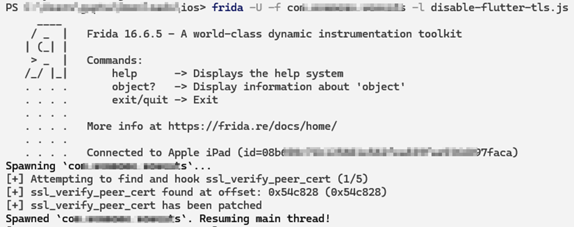
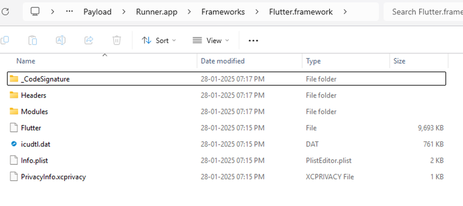
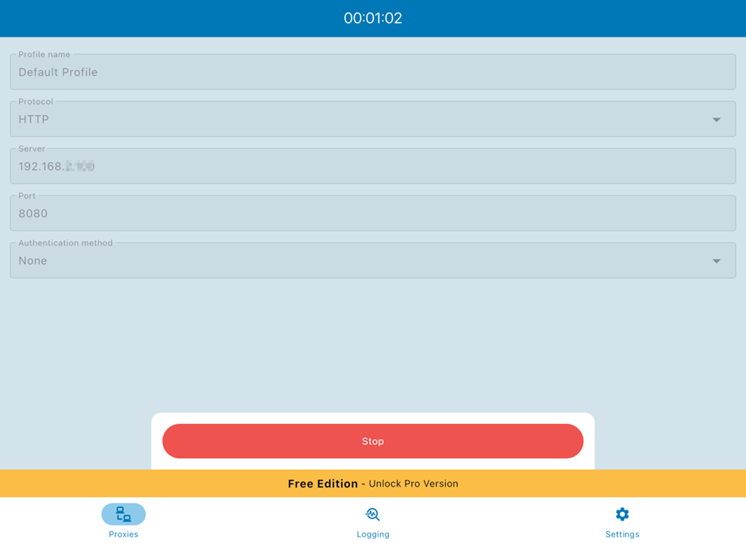

<!-- Welcome 👋 -->



## Overview
Recently, I was tasked with pentesting an iOS application built using Flutter. One of the biggest challenges I faced was intercepting network traffic because the application did not rely on a standard HTTP proxy. Traditional interception methods using Burp Suite or Charles Proxy were ineffective. This blog details how I successfully bypassed SSL pinning and captured the app's traffic using Frida.

## Understanding Flutter’s Network Stack
Flutter applications often use Dart's dart:io package for network communication instead of native HTTP clients. This means they might not route traffic through system-wide proxies, making traditional MITM (Man-in-the-Middle) interception ineffective.
Some popular network libraries used in Flutter apps include:
- dart:io.HttpClient
- package:http
- Dio
- WebSockets (dart:io.WebSocket)

Additionally, many Flutter apps enforce SSL pinning to prevent traffic interception by rejecting custom certificates.

## Initial Attempts and Challenges
### 1.  Using Burp Suite or Charles Proxy

  Initially, I tried configuring a standard proxy setup:
  - Installed Burp Suite’s CA certificate on the iOS device.
  - Configured the device to route traffic through Burp’s proxy.

After configuring the device with Burp proxy, the application was working fully without any errors, as if no proxy was configured. This led me to suspect that the application might be using custom socket connections.

### 2. Attempting Basic SSL Pinning Bypass

I initially used the Frida script from [NVISO](https://github.com/NVISOsecurity/disable-flutter-tls-verification/blob/main/disable-flutter-tls.js) Security to bypass SSL pinning:


frida -U -f your.package.name -l disable-flutter-tls.js


Although the script printed [+] ssl_verify_peer_cert has been patched in the terminal, as shown in the figure below:

I was still unable to see any traffic within Burp Suite. This further reinforced my suspicion that the application was using custom socket connections.

To verify if the application was built using Flutter, I renamed the .ipa file to .zip, extracted it, and then navigated to Payload/Runner.app/Frameworks/Flutter.framework, where Flutter-related files were present. This confirmed that the application was built using Flutter, as shown in the figure below:

## Using Frida and a Device-Wide Proxy to Intercept Traffic
Since the application might have been using direct socket connections, I decided to set up a device-wide proxy.

### Step 1: Configure a Device-Wide Proxy
To force all traffic through Burp Suite, I installed the Super Proxy application on the device. I then configured it with the IP and port corresponding to Burp Suite’s listening parameters, as shown in the figure below:

### Step 2: Run the Frida Script Again
With the device-wide proxy enabled, I reran the Frida script:

frida -U -f your.package.name -l disable-flutter-tls.js


### Step 3: Capturing Traffic with Burp Suite
With SSL pinning disabled and the system-wide proxy configured, I was finally able to intercept all network traffic, including API requests and WebSocket communications.

## Results and Findings

With SSL pinning disabled and a device-wide proxy configured, I could:
-	View API requests and responses.
-	Analyze WebSocket traffic.
-	Modify requests to test for security vulnerabilities.

## Conclusion and Key Takeaways
-	**Flutter apps often bypass system proxies**, making traditional MITM techniques ineffective.
-	**Frida is a powerful tool for bypassing SSL pinning**, especially in Flutter applications.
-	**A device-wide proxy configuration can help capture traffic** when applications use custom socket connections.

By leveraging Frida and understanding Flutter’s unique network stack, I was able to bypass SSL pinning and intercept traffic successfully. If you're facing similar challenges, I highly recommend experimenting with Frida scripts and configuring a system-wide proxy.
________________________________________
If you found this blog helpful, feel free to share it!